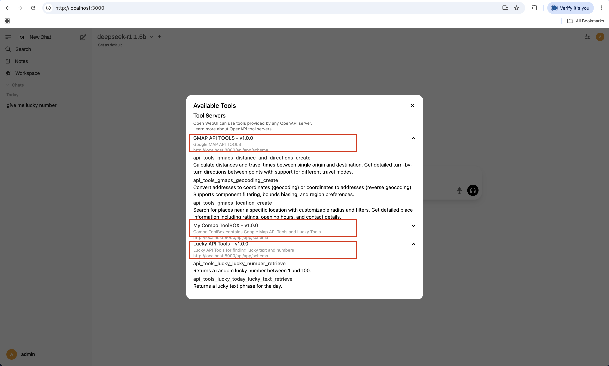

# Pico-Tools Backend

Pico-Tools is a powerful Django-based backend designed to serve and manage various tools through a flexible API. It allows users to create custom "Apps", each with its own authentication token and a curated set of tools. The backend dynamically generates an OpenAPI schema for each App, exposing only the selected tools.


## Features

-   **Multi-Tool Architecture**: Easily integrate and serve multiple, independent tools (e.g., Google Maps, Lucky Number generator).
-   **App-based Access Control**: Users can create "Apps", which are configurations that bundle a specific set of tools.
-   **Token Authentication**: Each App gets a unique bearer token for authenticating API requests.
-   **Dynamic OpenAPI Schema Generation**: Each App has its own browsable API schema (`/api/app/schema/{app_id}`), showing only the tools it has access to.
-   **Rate Limiting**: Per-app request rate limiting based on tiers.
-   **User Management**: Custom user model with email-based authentication, managed via the Django Admin.
-   **Modern Tooling**: Uses `uv` for package management and `ruff` for linting and formatting.
-   **Containerized**: Comes with Docker and Docker Compose for easy setup and deployment.

## Project Structure

The project is organized into three main Django apps:

-   `apps/auth`: Manages users and profiles.
-   `apps/app`: Manages the "App" configurations, including which tools an App can access, its authentication token, and its access tier. It's the core of the multi-tenant tool system.
-   `apps/tools`: Contains the actual tools that can be exposed via the API. Each tool is implemented as a `ViewSet`. Currently, it includes:
    -   **Google Maps Tools**: Wrappers around the Google Maps API for location search, geocoding, and directions.
    -   **Lucky Tools**: Simple tools to get a lucky number or text.

## API Endpoints

Authentication for the API is handled via bearer tokens specific to each "App". User and App creation/management is handled through the Django Admin interface.

### App Management

-   `GET /api/app/schema/{app_id}` - Get the OpenAPI schema for a specific app, detailing the available tool endpoints.

### Tools

Tool endpoints are available under `/api/tools/`. Access is granted based on the tools enabled for the App whose token is being used.

#### Google Maps Tools (`/api/tools/gmaps/`)

-   `POST /api/tools/gmaps/location/` - Search for nearby places.
-   `POST /api/tools/gmaps/geocoding/` - Geocode an address or reverse-geocode coordinates.
-   `POST /api/tools/gmaps/distance_and_directions/` - Get distance and directions between two points.

#### Lucky Tools (`/api/tools/lucky/`)

-   `GET /api/tools/lucky/lucky_number/` - Get a random lucky number.
-   `GET /api/tools/lucky/today_lucky_text/` - Get a "lucky" text phrase.

## Models

### `auth` app

-   **User**: Custom user model (`AbstractUser`) using email for authentication.
-   **UserProfile**: One-to-one extension of the User model for additional profile information.

### `app` app

-   **App**: Represents a user-created application. It links a user to a set of tools, a security token, and a rate-limiting tier.
-   **RequestAccessTier**: Defines different rate-limiting tiers (e.g., Basic, Pro) with a specific requests-per-second (RPS) limit.

### `tools` app

*(Note: The model definitions for the `tools` app were not provided in the context, but serializers and other files suggest their existence.)*

-   **ToolCategory**: For organizing tools into categories.
-   **Tool**: Represents an available tool in the system.
-   **UserTool**: A user's specific configuration for a tool (not currently used by the API tools, but part of the original design).

## Quick Start

### Prerequisites

-   Python 3.11+
-   Docker and Docker Compose
-   UV package manager

### Setup with Docker (Recommended for testing and development)

1.  **Navigate to the backend directory**:
    ```bash
    cd backend
    ```

2.  **Copy environment file**:
    ```bash
    cp docker/example.env docker/.env
    ```

3.  **Update the `docker/.env` file** with your settings, especially the `GOOGLE_MAPS_API_KEY`.

4.  **Start with Docker Compose**:
    ```bash
    docker-compose -f docker/docker_compose.yml up --build
    ```
    The API will be available at `http://localhost:8000`.

### Local Development

1.  **Navigate to the backend directory**:
    ```bash
    cd backend
    ```

2.  **Create virtual environment with UV**:
    ```bash
    uv venv
    source .venv/bin/activate  # On Windows: .venv\Scripts\activate
    ```

3.  **Install dependencies**:
    ```bash
    uv sync --active
    ```

4.  **Start PostgreSQL**:
    run Postgresql on your local or using docker

5.  **Set up environment variables**:
    Copy `docker/example.env` to `.env` in the `backend` directory and update it for your local setup (e.g., `DB_HOST=localhost`).

6.  **Run database migrations**:
    ```bash
    python manage.py migrate
    ```

7.  **Load initial data**:
    ```bash
    python manage.py loaddata apps/auth/fixtures/users.json
    python manage.py loaddata apps/app/fixtures/access_app.json
    ```
    This creates a superuser (`admin@admin.com` / password: `admin`) and some sample apps. You can use these credentials to log into the Django Admin.

8.  **Run development server**:
    ```bash
    python manage.py runserver
    ```

## Development

#### Login

To access the admin panel at `/admin`, use the following credentials:

- **Email:** `admin@admin.com`
- **Password:** `admin`

### Code Quality

This project uses `ruff` for linting and formatting.

```bash
# Install ruff  using pip if not already installed, using uv should already installed following above command

# Run linting (pip)
ruff format backend && ruff check backend

# Run linting (uv)
uv run --active ruff format backend && ruff check backend
```

### Short Video Preview

ensure to check the short video preview on `assets` folder

[](assets/output.mp4)


