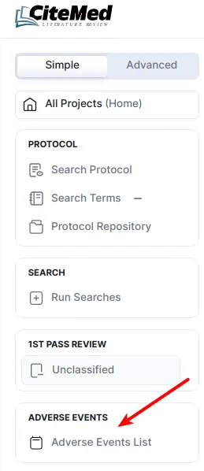

# Adverse Event Review

The Adverse Events page displays a list of Adverse Events/Recalls that are related to the subject/similar device.

This can be found in the Main Menu:

<figure><figcaption></figcaption></figure>

The adverse events arise from processing and completing search terms in Search Dashboard and Manual AE Searches. From this view, you can review & (Include/Exclude) these AEs.

Including these AEs can just be done with one click.

<figure><figcaption></figcaption></figure>

Other options can be selected from the Review page by clicking the Review link

If you’d like to mark an individual AE as ‘Included’ or ‘Duplicate’ during the review. You must perform the following steps.

1. Click into the AE detail view by clicking on the Review link, here’s the view you’ll see

<figure><figcaption></figcaption></figure>

2. Update the State of the event to your desired state.
3. Click Save or Save and Next

### Adding Manual Searched Adverse Events (non-Maude Databases)

Adverse Events can be added manually as much as required for databases from this view. The AEs can also be edited and removed as needed

All this can be accessed from the **Main Advanced** **Menu**

You just need to select the database you wish to add an adverse event for example “UK MHRA” in the below screenshot then click on “Add Event Form”

<figure><figcaption></figcaption></figure>

The form to fill out is general, and should cover all formats of Adverse Event data you are likely to come across (every country does it a little differently). Fill out the form and click Add Event Form.

<figure><figcaption></figcaption></figure>

### Writing Adverse Event Summaries

For all included/similar Adverse Events and Recalls summaries can be added for each databases. You’ll see that these AEs & Recalls are grouped by their Database.

This can be accessed from the **Main Advanced Menu:**

<figure><figcaption></figcaption></figure>

To add a summary is quite easy! Just navigate to the page and then to the summary section, fill it out and then click submit.

<figure><figcaption></figcaption></figure>

We use summaries to discuss any relevant adverse events. These sections are put into the final reports (Word Documents Generated) to allow for you to explain the events any way you choose.
