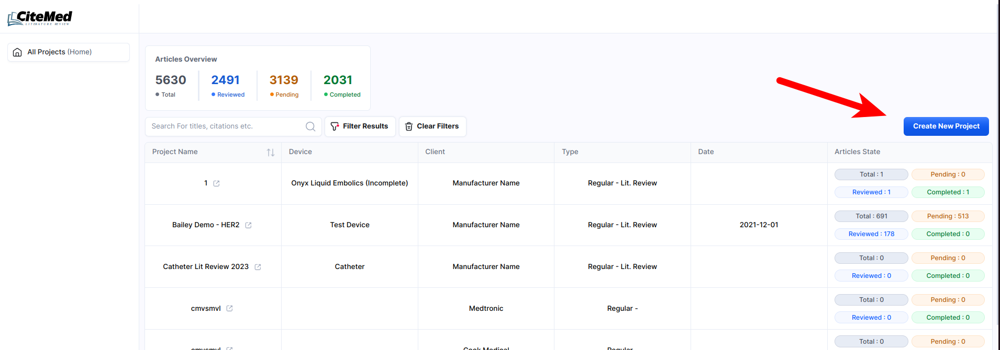

# Quickstart

These sections are all about getting set up to perform your search. They are simply forms to fill out in order to provide the information necessary for final report generations.

Beautiful documentation starts with the content you create — and GitBook makes it easy to get started with any pre-existing content.


Want to learn about writing content from scratch? Head to the [Basics](https://github.com/GitbookIO/onboarding-template/blob/main/getting-started/broken-reference/README.md) section to learn more.


### Creating a Project

To initiate a new project, simply click ‘Create New Project’ from the Home Page

<figure><figcaption></figcaption></figure>

This will take you to a screen to enter the details about your project.

<figure><figcaption></figcaption></figure>

### Creating a Device and a Company

If this is your first time running a project (or for a new Manufacturer, or new Device), you will need to create short profiles with the relevant information.

Fill out the following form fields:

<figure><figcaption></figcaption></figure>

**Name:** This is the name that will show up within the [CiteMed.io](http://citemed.io) app. It’s more of an identifier/internal name.

**Short Name:** This is the non-legal name of the manufacturer used in more casual references.

**Long Name**: The full legal entity name of the manufacturer.

**Address:** Manufacturer’s corporate address.

**Logo**: A logo image that will be automatically inserted into final Microsoft Word Document Deliverables

<table><thead><tr><th width="184">Field</th><th>Description</th></tr></thead><tbody><tr><td><strong>Name</strong></td><td>This is the name that will show up within the <a href="http://citemed.io">CiteMed.io</a> app. It’s more of an identifier/internal name.</td></tr><tr><td><strong>Short Name:</strong></td><td>This is the non-legal name of the manufacturer used in more casual references.</td></tr><tr><td><strong>Long Name</strong></td><td>The full legal entity name of the manufacturer.</td></tr><tr><td><strong>Address</strong></td><td>Manufacturer’s corporate address.</td></tr><tr><td><strong>Logo</strong></td><td>A logo image that will be automatically inserted into final Microsoft Word Document Deliverables</td></tr></tbody></table>

### Select or Create a New Product/Device

The ‘Device’ is the target device for which you are performing the review. It is created with a basic form inside the ‘New Project’ page.

<figure><figcaption></figcaption></figure>

<table><thead><tr><th width="198">Field</th><th>Description</th></tr></thead><tbody><tr><td>Device Name</td><td>The marketing (official) name of your device/product.</td></tr><tr><td>Manufacturer</td><td>You will select from a list of created Manufacturer profiles.</td></tr><tr><td>Classification</td><td>This is the risk classification of the device (IIa, III, A, B, C etc.)</td></tr><tr><td>Markets</td><td>An abbreviated line of markets where the product is sold (this is not required for reviews). ie. “EU, US, China”</td></tr></tbody></table>

### Project Type

The project type has several options, most of which will not affect standard users (only enterprise).

| Project    | Description                                                                                                          |
| ---------- | -------------------------------------------------------------------------------------------------------------------- |
| Lit Review | Standard Review (most users should select this).                                                                     |
| CER        | Those using other [CiteMed.io](http://citemed.io/) tools and performing Clinical Evaluation Reports can select this. |
| PMCF       | If report is conducted as part of a Post Market Clinical Follow-up procedure, you can select this option.            |
| Vigilance  | If report is performed for vigilance or Post Market Surveillance purposes, select this option.                       |

