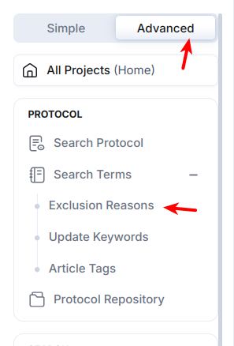

# Define Exclusion Reasons

Exclusion reasons are used primarily in the 1st Pass Abstract Review, to standardise the exclusion of Articles. By Default, the [CiteMed.io](http://citemed.io/) team has provided general reasons that you can use right away.

### Adding New Exclusion Reasons

### Exclusion Reasons

Edit exclusion reasons from the Advanced Menu.

These are the pre-set reasons for which you will be ‘Excluding’ Abstracts during the **1st Pass Abstract Review** part of the app.

<figure><figcaption></figcaption></figure>

### Exclusion Reason Actions

You can add, edit, or delete reasons to your liking.

<figure><figcaption></figcaption></figure>

