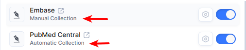
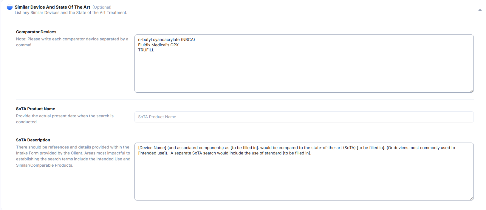
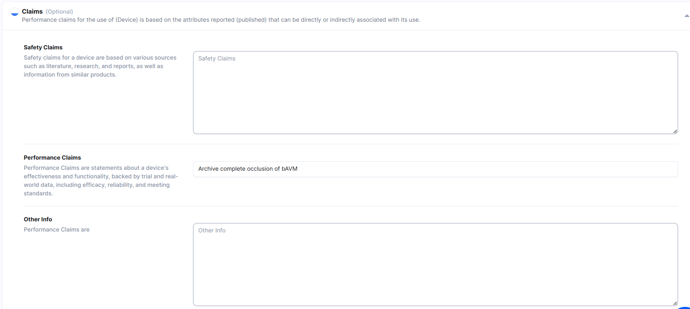

# Defining Your Search Protocol

### The Search Protocol Page

The Search Protocol Page can be accessed from the Simple or Advanced Menus

<figure><figcaption></figcaption></figure>

The Search Protocol Is Broken Up Into 7 Sections:

* Search Parameters
* Databases to Search
* Device Description and Use
* Similar Device and State of the Art
* Claims
* Scope of Review
* Preparer

#### Search Parameters

Search Parameters are pretty straight forward. Set your date ranges for both Literature, and Adverse Events, as well as the Search Results Limit.

<figure><figcaption></figcaption></figure>

#### Search Results Limit

This value is the upper limit of results that the system will import for any given search. For example, if Max Hits is set to 500, a search of size 1000 will be excluded when uploaded.

### Databases to Search

Select the Databases you will ultimately be searching (Clinical and Adverse Event Databases)

<figure><figcaption></figcaption></figure>

#### Automated Vs. Manual Collection

Notice that each database has a label for Automatic or Manual collection.

<figure><figcaption></figcaption></figure>

**Automatic Collection -** We can search, download results, and process them for you full automatically.

**Manual Collection -** We can process the results, but you will have to _go to the database and perform the search yourself, and then upload the results to the CiteMed app._

### Device Description and Use

_Please Note, these fields are only required if **you intend to generate the polished, Microsoft Word Output documents.** These fields will be copied directly into your final reports._

These are optional text fields related to your subject of the search.

<figure><figcaption></figcaption></figure>

### Similar Device and State of the Art

_Please Note, these fields are only required if **you intend to generate the polished, Microsoft Word Output documents.** These fields will be copied directly into your final reports._

Optional text fields to add discussion of your State of the Art, or Comparator/Similar Products.

<figure><figcaption></figcaption></figure>

### Claims

_Please Note, these fields are only required if **you intend to generate the polished, Microsoft Word Output documents.** These fields will be copied directly into your final reports._

<figure><figcaption></figcaption></figure>

### Scope of Review

This is a simple paragraph written to discuss the purpose and scope of the review being performed. It’s useful and required for some regulatory based literature reviews protocols.

### Preparer

This is the the signatory on the review. Enter your name and title here.

