# Report Output Types (With Examples)

## CiteMed Report Output Types

***

After completing your review many output types can be generated. They come in various forms:

* Word Document
* Excel Sheet
* Zip File (of article PDFs, or Audit Trail for example)

***

## Search Protocol Generation

***

### Search Term Summary

**Formats:** Excel, Word

**Contents:**

This is an excel sheet containing all search terms and which databases each term is scheduled to be run on. You can use it for a quick sanity check to make sure your terms are set up properly.

Example File



<figure><figcaption></figcaption></figure>

***

### Search Protocol

**Formats:** Word

**Contents:** The protocol contains the contains key information about the Literature Review that will be conducted such as product info and descriptions, which databases will be searched, process for abstract review and full text review. This template can be used or modified to suit, but was designed for compliance with Meddev 2.7.1 rev4 and subsequent EU MDR.

**Key Sections**

Overview and Background

* Device Basics & Classification
* Intended Use & Target Application
* Performance & Safety Claims
* Comparative Devices

Search Methodology

* Search Scope & Date Range
* Qualified Search Personnel
* Scientific Database Coverage
* Adverse Event Database Coverage

Search Strategy

* Systematic Review Approach
* Search Term Development
* Database-Specific Techniques
* Boolean Search Parameters

Selection and Review Process

* Abstract Review Methodology
* Inclusion/Exclusion Criteria
* Full-Text Review Process
* Duplicate Management

Extraction and Appraisal Criteria

* State-of-the-Art Assessment Criteria
* Suitability & Data Contribution Scoring
* Evidence Quality Grading System
* Clinical Relevance Analysis

**Example File**



**Images**

<figure><figcaption></figcaption></figure> <figure>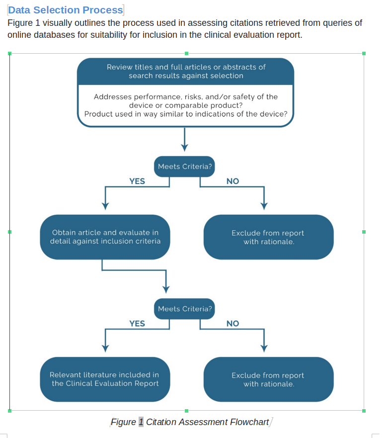<figcaption></figcaption></figure> <figure>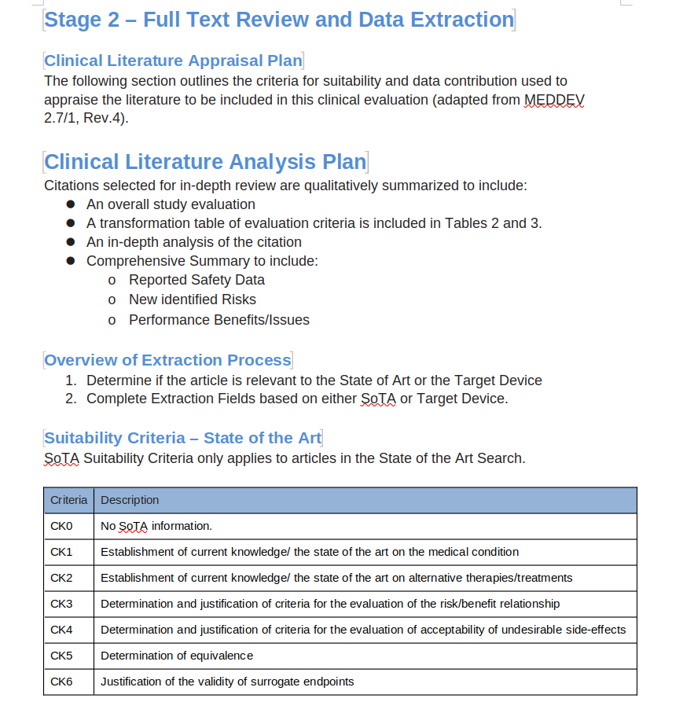<figcaption></figcaption></figure> <figure>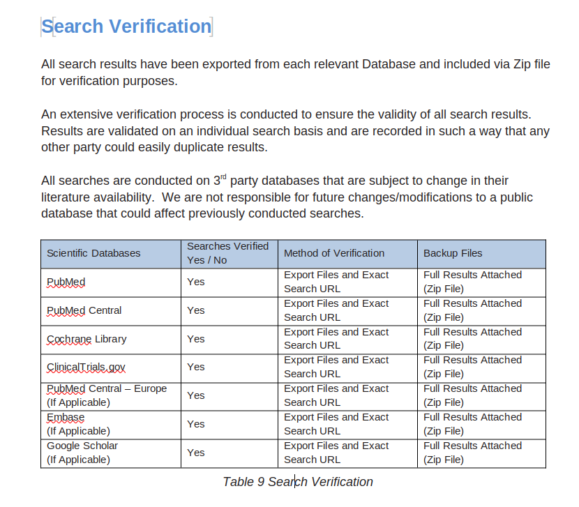<figcaption></figcaption></figure>

***

## Literature Review Report Outputs

***

### Full Review Output

**Formats: Excel, Word**

**Contents(Excel):** Contains the List of articles processed during the first pass with their details. Columns Include the below:

Columns for Excel Output

* Article Title

- Abstract

* Citation

- Search Term/Database queried to get the result

* Review State (Unclassified, Retained, Excluded, Duplicate)

- Article Tags&#x20;

* Exclusion Reason

- Relevancy Score (CiteMed Calculated)

* All Extraction Fields (these are custom to your review)
  * Multi-Arm Trials Tracked Individually

- PubMed or FT Link if freely available

**Contents(Word)**:&#x20;

This is the submission-ready report template containing your entire systematic review. It will include:

Overview and Methodology

* Background ,description etc.

- Search Methodology and and Selection Criteria

* Search Methodology Summaries and Prisma Flow Chart

Search Result Summaries

Tables showing all output of both (separate) State of the Art and Subject Device Searches

Example:

<table><thead><tr><th width="120.4000244140625">Database</th><th width="137.20001220703125">Search Term</th><th>Result Count</th><th width="100">Included</th><th width="100.7999267578125">Excluded</th><th>Duplicate</th></tr></thead><tbody><tr><td>PubMed</td><td>Catheter</td><td>10</td><td>2</td><td>8</td><td>0</td></tr><tr><td>PubMed</td><td>Catether Flow Rate</td><td>25</td><td>5</td><td>12</td><td>8</td></tr></tbody></table>

Search Results (Full Review Results)

Every abstract/citation and it's state of the review (Included, Excluded with Reason, Duplicate etc.)

Data Extraction and Clinical Appraisal

Data extraction tables show per your configuration

References for Included Citations

List of references for all retained/included citations

Adverse Event Results

* Adverse event search strategy
* Adverse event results (tables summarized by incident severeity and source)
* Discussion/Commentary

Search Verification

Documented process about how searches are validated and results can be trusted.

**Images**

<figure>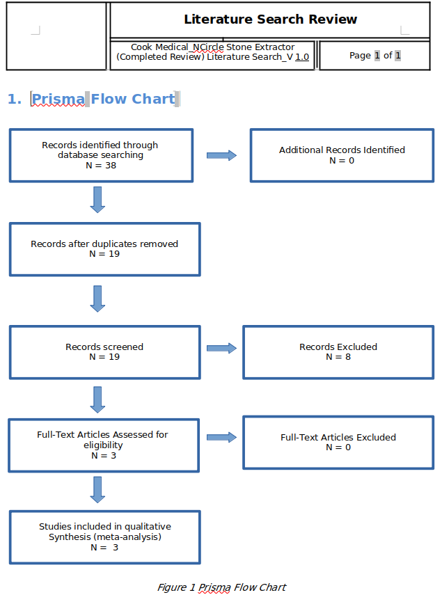<figcaption></figcaption></figure> <figure>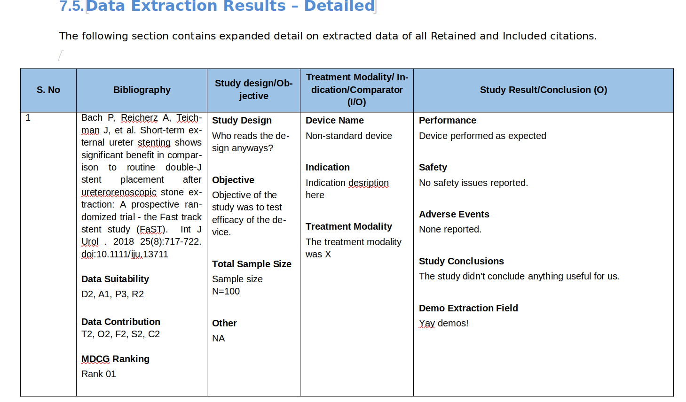<figcaption></figcaption></figure> <figure>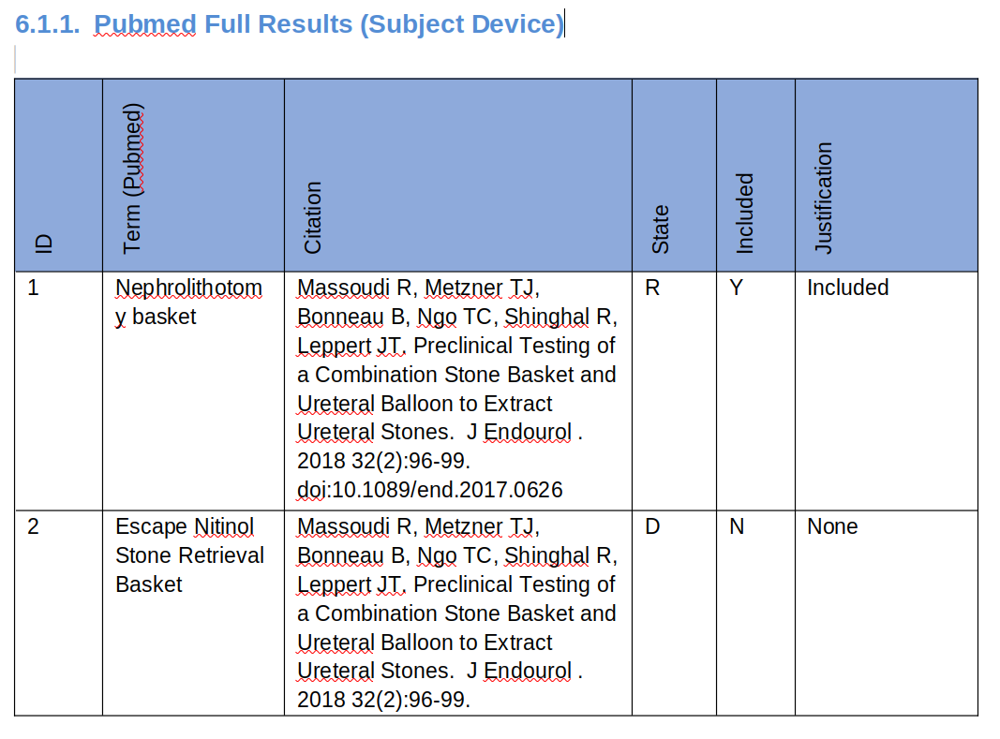<figcaption></figcaption></figure> <figure>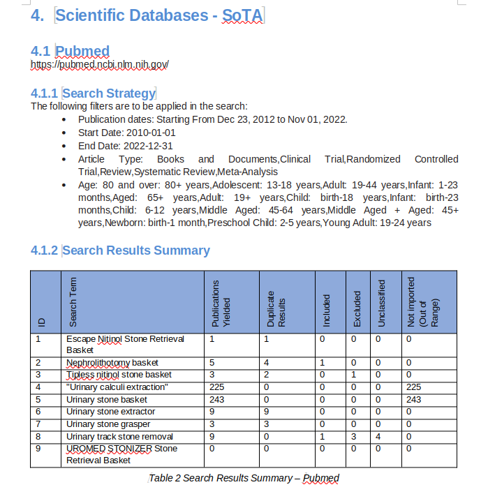<figcaption></figcaption></figure> <figure>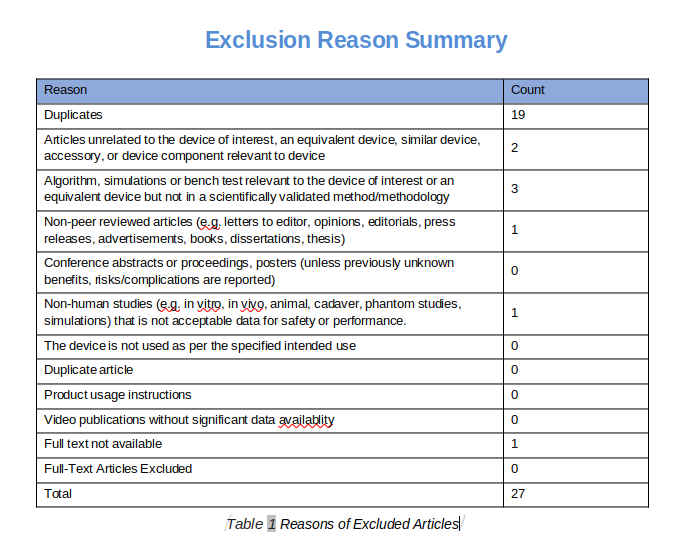<figcaption></figcaption></figure> <figure><figcaption></figcaption></figure> <figure>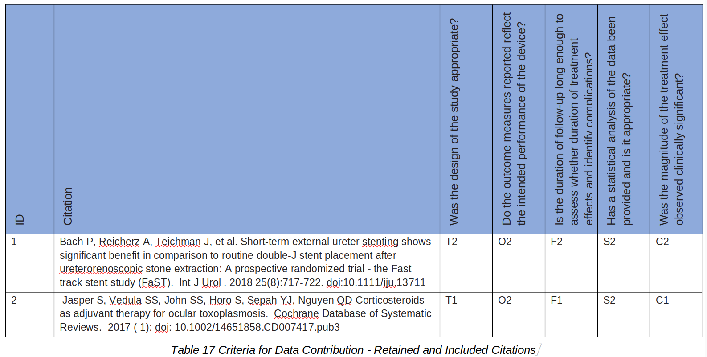<figcaption></figcaption></figure> <figure>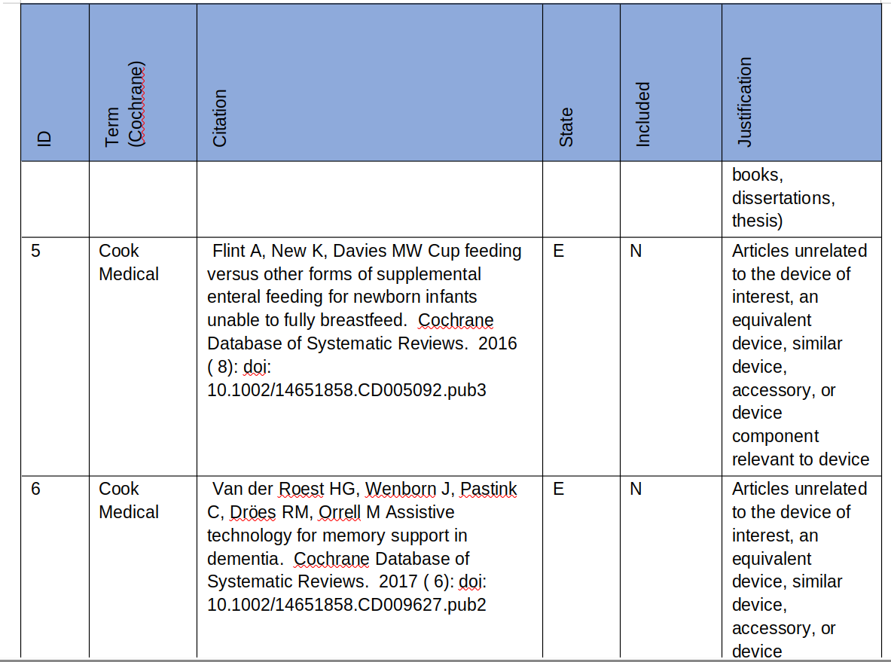<figcaption></figcaption></figure>

<figure>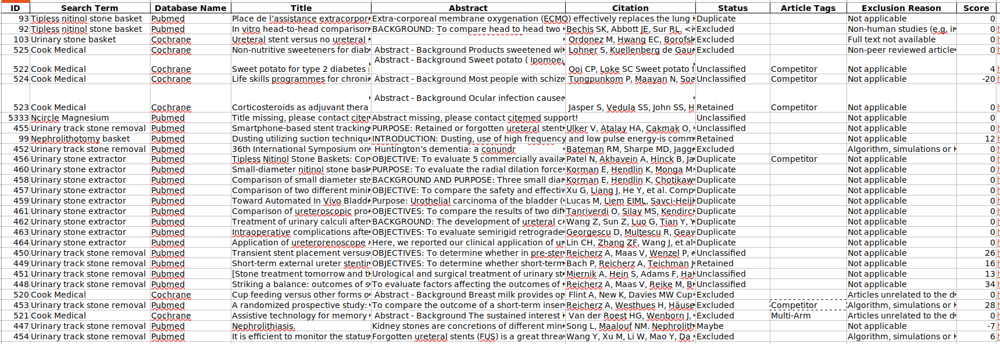<figcaption></figcaption></figure>

**Example File:**





***

### Second Pass Extraction Articles

**Formats: Word, Excel**

**Contents: C**ontains the List of included articles processed during the second pass with their appraisal details only.

**Images:**

<figure><figcaption></figcaption></figure> <figure>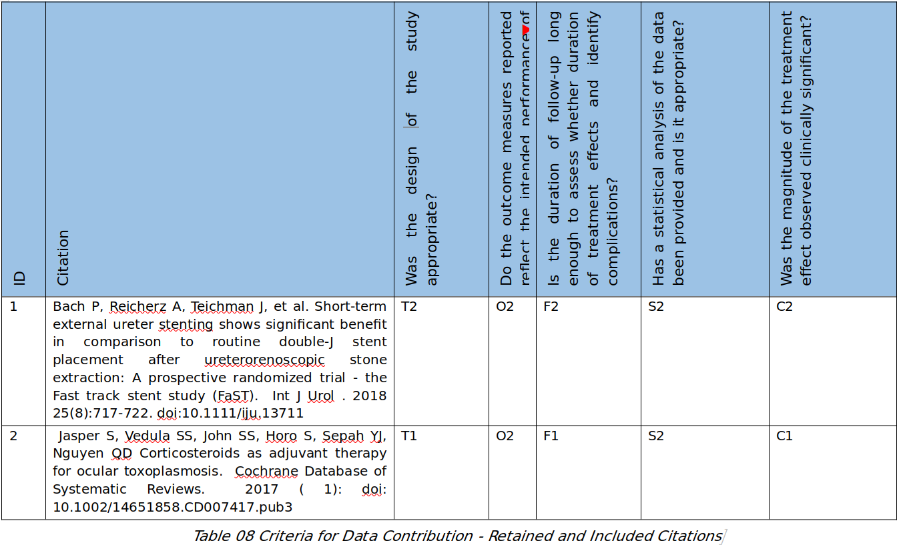<figcaption></figcaption></figure> <figure>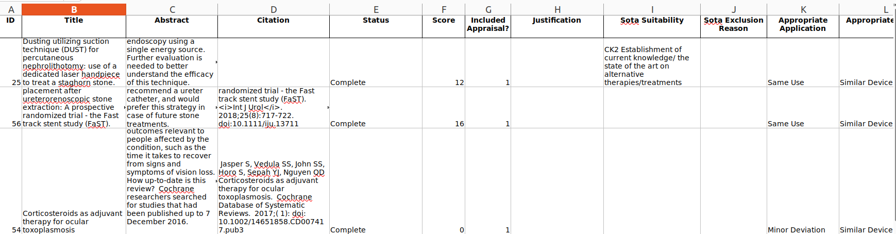<figcaption></figcaption></figure> <figure>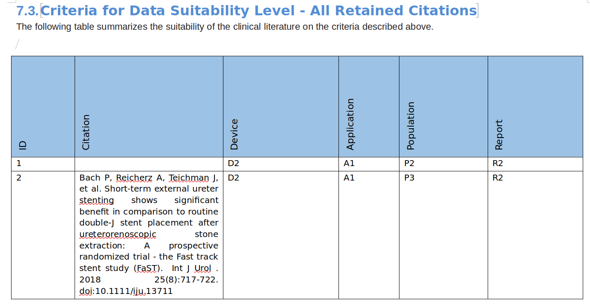<figcaption></figcaption></figure>

**Example Files:**





***

### Prisma Diagram

**Formats**: Zip, Excel, DOCX

**Contents:** Prisma contains the Flow Chart + Table represent the different stages of the review conducting with how many articles were included, excluded, marked as duplicate ...etc

Images

<figure><figcaption></figcaption></figure> <figure>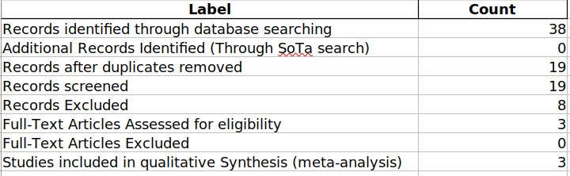<figcaption></figcaption></figure>

**Examples:**





***

### Excluded/Duplicates Summary: Excel



Article Tags Summary: Tags applied to articles for additional sorting: Excel



***

### Full Text Article PDFs

**Formats**: Zip

**Contents**: Contains the List of Included Articles Full Text PDFs

**Examples**:



***

### Condensed Report

**Formats**: Zip of word docs

**Contents**: This is the real ‘meat’ of your report. Containing all significant sections with **only** discussion and review of the Retained literature. If you are planning to just copy out the data extraction tables into your own report template, the condensed report makes this much easier.

**Examples**:



***

### Search Validation Zip

**Formats**: Zip of several filetypes

**Contents**: The search validation zip file is for your auditors. It contains the exact search file from every single search performed directly on the associated database. This is the ultimate justification for getting a reproducible search.

**Examples**:



***

### Appendix E2 (Adverse Events) Report

**Formats**: Word, Excel

**Contents**: Appendix E2 contains all Maude processed events and any associated summary commentary.

**Examples:**





